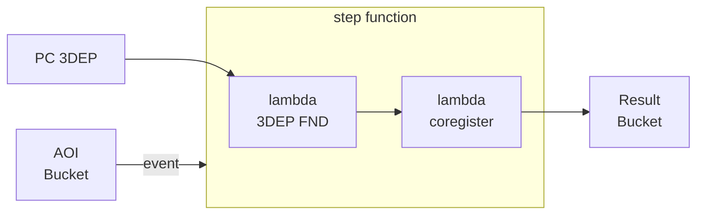
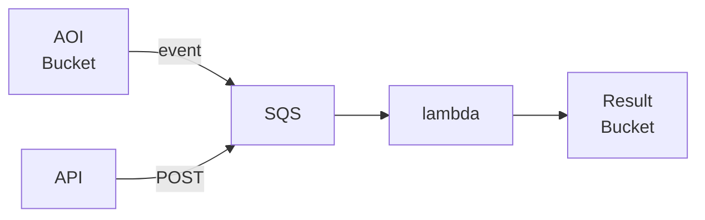

## Methods

1. AOI bucket trigger: static Foundation

    ```mermaid
    flowchart LR
        S3_AOI["AOI <br> Bucket"] -- trigger --> lambda
        S3_FND["FND <br> Bucket"] --> lambda
        lambda --> S3_RST["Result <br> Bucket"]
    ```

2. AOI bucket trigger: dynamic Foundation



3. Queue feeders:
    - Bucket create event
    - API POST


