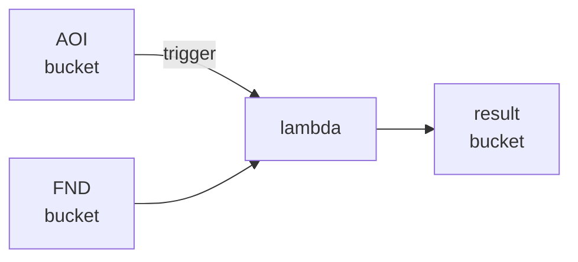
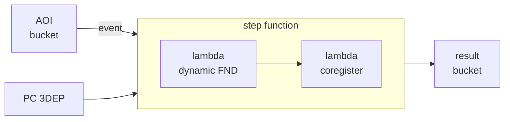
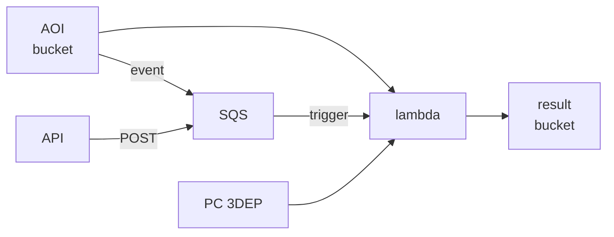

# AWS Methods

### 1. AOI bucket with static Foundation - &check;

  

### 2. AOI bucket with step function and dynamic Foundation - &check;

  

### 3. AOI bucket and API feeding a queue - Under construction

  

### 4. Cirrus?
